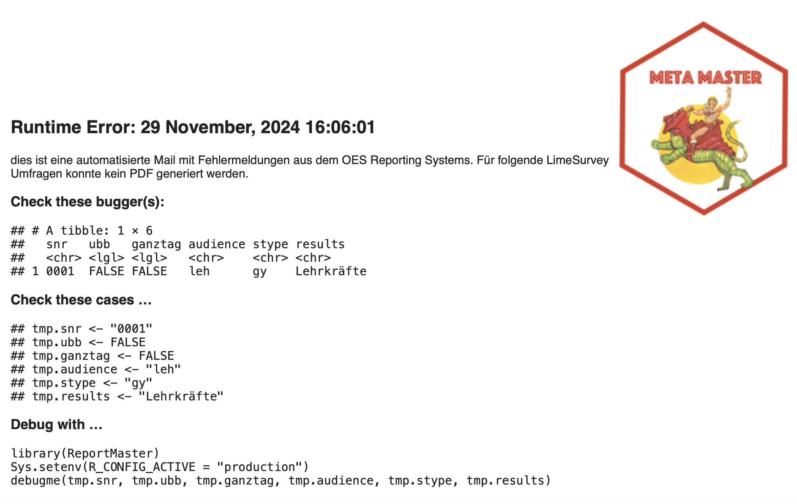

```{r, include = FALSE}
knitr::opts_chunk$set(
  collapse = TRUE,
  comment = "#>"
)
```

```{r setup, include=FALSE}
library(ReportMaster)
```

The ReportMaster package is designed to create dynamic survey reports automatically. The package retrieves data from Lime Survey, combines it with meta data to create dynamic reports and runs only for surveys that are expired.

This vignette provides a brief overview of the package and its functions. Make sure that you have a configuration file ('config.yml') in your home directory [@config]. The configuration file is necessary to connect to the Lime Survey API and the database.

## ReportMaster in Action

The `run_CronJob()` function is the main function of the package. It checks for expired surveys and creates reports accordingly.

```{r, eval=FALSE}
run_CronJob()
# Lucky fellow, there are new expired surveys!
# Joining with `by = join_by(sid)`
# Joining with `by = join_by(sid)`
# ℹ Get parameters for: Adalbert-Raps-Schule Staatliche Berufsoberschule Kulmbach
# Joining with `by = join_by(sid)`
# Joining with `by = join_by(sid)`
# Joining with `by = join_by(sid)`
# Joining with `by = join_by(sid, vars)`
# ✔ Downloaded data from LimeSurvey.
# ✔ All parameters set.   
# ✔ Create data and plots [3.3s]
# ✔ Get report infos [881ms]
# ✔ Create plots [2.1s]────────────────────────────────────────────────────── 100%
# ✔ Create tables [4.4s]───────────────────────────────────────────────────── 100%
# ✔ Exported PDF file for school '0850' and group 'elt'
```

What happens if in case of an error? The `run_CronJob` function sends an email to the OES with the error message.

```{r, eval=FALSE}
# ℹ Get parameters for: Leibniz-Gymnasium Altdorf
# Joining with `by = join_by(sid)`
# Joining with `by = join_by(sid)`
# Joining with `by = join_by(sid)`
# Joining with `by = join_by(sid, vars)`
# ✔ Downloaded data from LimeSurvey.
# ✔ All parameters set.   
# ✔ Create data and plots [2.9s]
# ✔ Get report infos [665ms]
# ✖ Create plots [2.2s]───────────────────────────────────────────           100%
# The email message was sent successfully.
```

In case of an error, inspect the email. It notes which survey throw an error and it provides a code snippet to debug it.

{width="100%"}

Copy the code and use the `debugme()` function to find the error. The function runs the code linearly and returns the error message.

```{r, eval=FALSE}
tmp.snr <- "0001"
tmp.ubb <- FALSE
tmp.ganztag <- FALSE
tmp.audience <- "leh"
tmp.stype <- "gy"
tmp.results <- "Lehrkräfte"

library(ReportMaster)
Sys.setenv(R_CONFIG_ACTIVE = "default")
debugme(tmp.snr, tmp.ubb, tmp.ganztag, tmp.audience, tmp.stype, tmp.results)

# Get parameters for: Leibniz-Gymnasium Altdorf
# Joining with `by = join_by(sid)`J
# Joining with `by = join_by(sid)`
# Joining with `by = join_by(sid)`
# Joining with `by = join_by(sid, vars)`
# ✔ Downloaded data from LimeSurvey.
# ✖ Create data and plots: [29ms]
# [1] "Error in plotGetData(): Can't join meta data with limesurvey data. 
# Check: A423W243l"
```

## The Naked ReportMaster

Let's inspect the 'run_CronJob' function to get a better idea about the package.

```{r}
run_CronJob
```

First, it checks whether there are new expired surveys. If there are, it returns a tibble with the school name, school type (stype), and further information that is necessary to create reports. The function also checks if these survey have a valid survey response. The function parameter `append` adds the overall report for each school and survey.

```{r, eval=FALSE}
snrlist <- get_snrlist(append = TRUE)
snrlist
# Lucky fellow, there are new expired surveys!
# Joining with `by = join_by(sid)`
# Joining with `by = join_by(sid)`
# # A tibble: 4 × 7
#   snr   ubb   ganztag audience stype   results               check
#   <chr> <lgl> <lgl>   <chr>    <chr>   <chr>                 <lgl>
# 1 0001  FALSE FALSE   leh      gy      Lehrkräfte            TRUE 
# 2 0001  FALSE FALSE   all      gy      Alle Befragtengruppen TRUE 
# 3 0850  FALSE FALSE   elt      beru_fb Eltern                TRUE 
# 4 0850  FALSE FALSE   all      beru_fb Alle Befragtengruppen TRUE 
```

Next, the function runs the `run_Parallel` function. This function is essentially the heart of the package. It runs the steps to create a report in parallel: First, it retrieves the data from Lime Survey via the `get_parameter()` function. Then, it creates a list of plots via the `export_plot()` function; and a list of tables via the `get_table()` function. Finally, it creates a Rmarkdown template where all plots and tables are insert and renders the report via `rmarkdown::render()` function.

After the `run_Parallel()` had done its job, the `run_CronJob()` checks if there was any errors and sends an email with the `blastula` package. Make sure that you mail credentials can be found in the root directory in a file called \`my_mail_creds\`. The blastula package will also help you to create a new one [@blastula].

## Report Master in Production

The package is designed to run in a docker container. Create a new image with the following Dockerfile:

```{bash, eval=FALSE}
#FROM rocker/r-ver:4.4.1
FROM rocker/verse:4.4.1

# Set up the locale to avoid encoding issues in R, set to German locale
RUN echo "de_DE.UTF-8 UTF-8" > /etc/locale.gen && \
    locale-gen de_DE.UTF-8 && \
    update-locale LANG=de_DE.UTF-8
    


# Install R packages that are needed even before running renv::restore()
RUN  R -e "install.packages('renv', repos='https://cloud.r-project.org')"
   

# Install TinyTeX

# Install required LaTeX packages
RUN tlmgr option repository ctan
#RUN R -e "tinytex::tlmgr_install(c('pdflscape', 'environ', 'fp', 'pgf', 'tcolorbox', 'trimspaces'))"
RUN R -e "tinytex::tlmgr_update()"
RUN tlmgr option autobackup 0 

# Set the working directory
WORKDIR /app

# Copy project files into the container (includes renv.lock and renv directory)
COPY . .

# Run renv::restore() to restore R package dependencies
RUN R -e "renv::restore()"
RUN R -e "install.packages('svglite', repos='https://cloud.r-project.org')" 

# Set the environment variable for locale and TinyTeX path
ENV LANG=en_US.UTF-8
ENV PATH=/root/.TinyTeX/bin/x86_64-linux:$PATH


# Set the entry point to run your main R script
ENTRYPOINT ["Rscript", "prog/edgar.R"]
```

In a nutshell, the Dockerfile installs the verse image from rocker. It installs other software dependencies, TinyTeX and the required (LaTeX) packages. Most importantly, it installs the `renv` package [@renv]. The `restore()` function is run to restore the R package dependencies. Finally, the entry point is set to run the main R script.

## References
